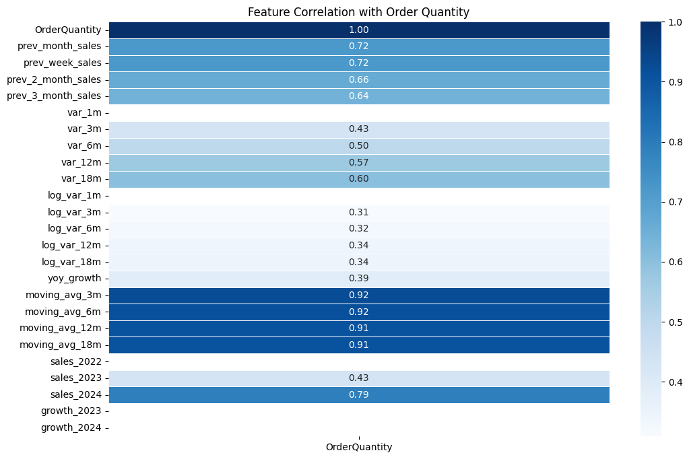
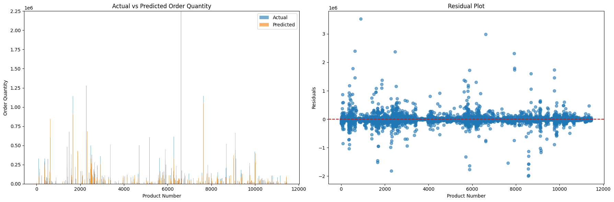
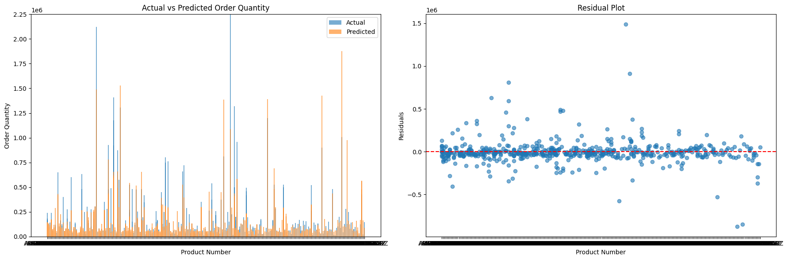
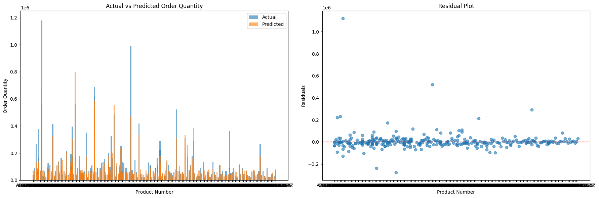
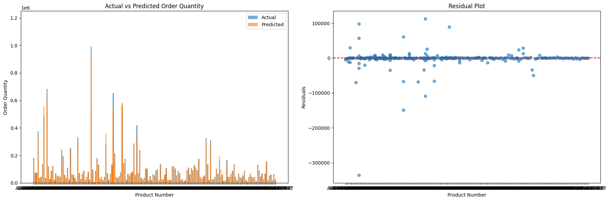
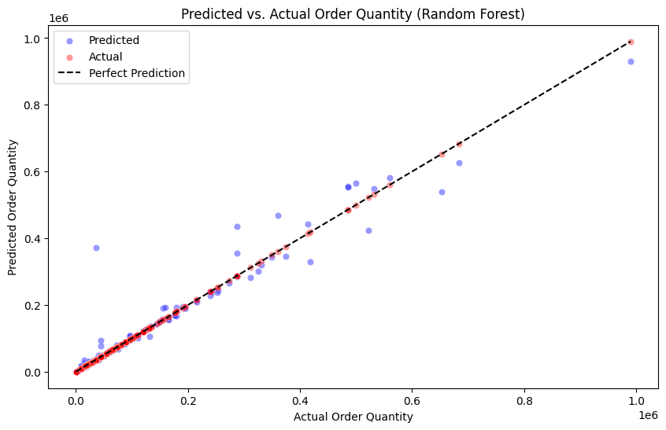

# Model Performance Evaluation

Throughout the development the model performance is documented as different training additions / validation tests are made.

## Feature Importance (Correlation) / Feature Engineering

Ensuring the correct independant variables are chosen for the final model are crucial, but too many or too less can cause in overfitting or underfitting.

To understand the correlation between dataset features and OrderQuantity, this heatmap shows the importance of each feature by score from 0 - 1.0 (0% - 100%) on contribution to the final OrderQuantity.

## Model Training / Independant variable choice-making

Random Forest with CV & Outliter removal
| Evaluation Metric | Score |  
| --- | --- |
| MAE | 84860.9381 |
| MSE | 41863556821.9018 |
| RMSE | 204605.8573 |
| R² | 0.1196 |

Random Forest - CV & Outlier removal & Param grid (Doesnt look correct on plot)
| Evaluation Metric | Score |
| --- | --- |
| MAE | 7.2066 |
| MSE | 758.3109 |
| RMSE | 27.5374 |
| R² | -0.1655 |

Random Forest with CV & Param grid (With outliers)
| Evaluation Metric | Score |  
| --- | --- |
| MAE | 81106.3853 |
| MSE | 29933938412.4621 |
| RMSE | 173014.2723 |
| R² | 0.2059 |

### Adding more independant features due to poor performance

#### Reducing test samples to train model based on each unique customer (to try and get better performance metrics)

_including CV & param grid as previous. Target:OrderQuantity, Independant: ProductNumber_

Random Forest (terrible performance)
(independants added: **order_year, order_month, order_week, order_day**)
| Evaluation Metric | Score |
| --- | --- |
| MAE | 217596.9560 |
| MSE | 127122041934.9724 |
| RMSE | 356541.7815 |
| R² | -0.7587 |

Random Forest (improved from previous)
(independants added: order_year, order_month, order_week, order_day, **PhysicalInv**)
| Evaluation Metric | Score |
| --- | --- |
| MAE | 115681.3014 |
| MSE | 78442116152.2402 |
| RMSE | 280075.1973 |
| R² | -0.0853 |

_Score was poor due to normalizing data and then training, if normalizing first. No data leakage_

Random Forest
(independants added: order_month, order_week, PhysicalInv, **order_weekday, is_weekend,inventory_ratio, is_backordered, Customer_Num**)
| Evaluation Metric | Score |
| --- | --- |
| MAE | 83322.1957 |
| MSE | 35148162591.4023 |
| RMSE | 187478.4323 |
| R² | 0.5413 |

Random Forest
(independants added: order_month) - better performance when removed the additional independants
| Evaluation Metric | Score |
| --- | --- |
| MAE | 84654.0300 |
| MSE | 34939603632.0258 |
| RMSE | 186921.3836 |
| R² | 0.5440 |

Random Forest
(independants added: order_month, **prev_month_sales, prev_week_sales, moving_avg_3m**)
| Evaluation Metric | Score |
| --- | --- |
| MAE | 59612.8726 |
| MSE | 19000357912.5767 |
| RMSE | 137841.7858 |
| R² | 0.7490 |

_Adding past sales quantities and moving avg last 3 months raise score_

Random Forest
(independants added: order_month, prev_month_sales, prev_week_sales, moving_avg_3m, **moving_avg_12m, moving_avg_18m, var_12m, var_18m,log_var_12m, log_var_18m, yoy_growth, prev_2_month_sales, prev_3_month_sales**)

| Evaluation Metric | Score           |
| ----------------- | --------------- |
| MAE               | 14893.2312      |
| MSE               | 1644616173.3435 |
| RMSE              | 40553.8676      |
| R²                | 0.8944          |

_Discussion: calculated different statistics regarding historical sales/variation so model handles OrderQuantity predictions better_

Random Forest
(independants added: order_month, prev_month_sales, prev_week_sales, moving_avg_3m, moving_avg_12m, moving_avg_18m, var_12m, var_18m,log_var_12m, log_var_18m, yoy_growth, prev_2_month_sales, prev_3_month_sales, **moving_avg_6m, var_3m, log_var_3m, sales_2023, sales_2024**)

| Evaluation Metric | Score          |
| ----------------- | -------------- |
| MAE               | 5553.3228      |
| MSE               | 584871441.8540 |
| RMSE              | 24184.1155     |
| R²                | 0.9575         |

#### Notes

Implement feature engineering to see if perfromance could be improved
Maybe change standard scaler? could be effecting weighting? (✅)

Seperate products by customer (may help with regression?) (✅)
