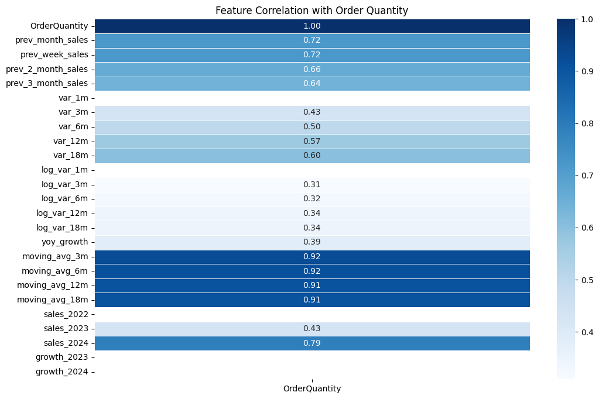
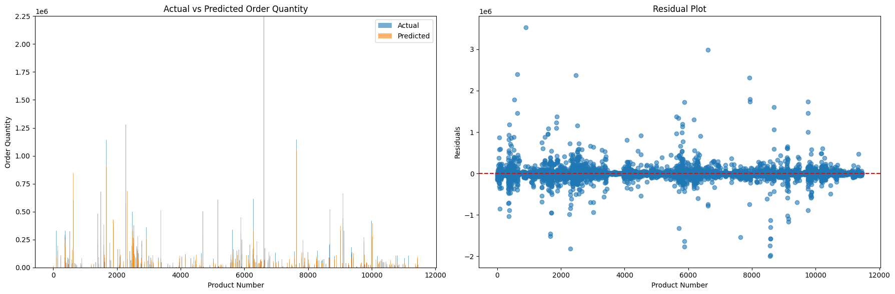
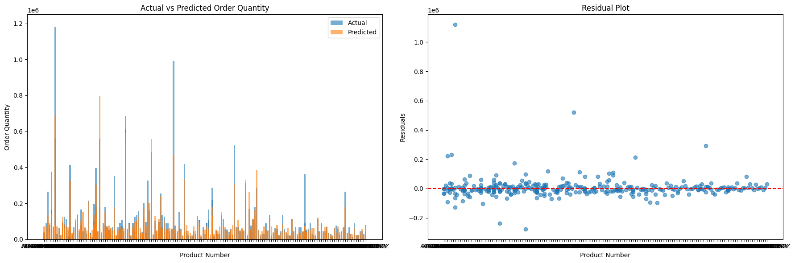
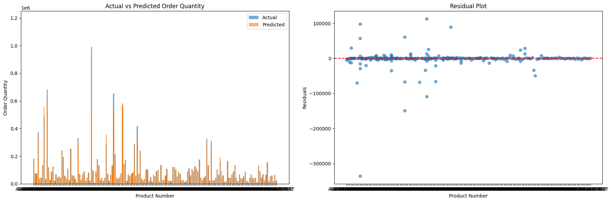
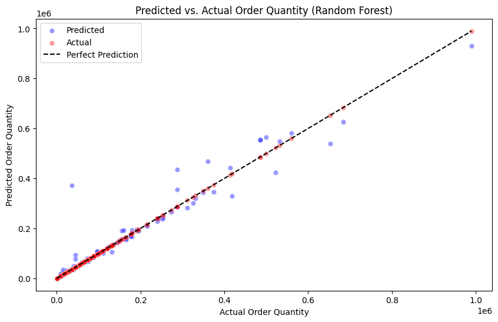

# Model Performance Evaluation

Throughout the development the model performance is documented as different training additions / validation tests are made.

Model performance varies depending on which customer is chosen to be evaluated (although is around the same, it does vary).

Since the partnering companys most ordered from company is 'Albertsons' (ALB). Most train/test has been performed on this customer during the development phase.

## Feature Importance (Correlation) / Feature Engineering

Ensuring the correct independant variables are chosen for the final model are crucial, but too many or too less can cause in overfitting or underfitting.

To understand the correlation between dataset features and OrderQuantity, this heatmap shows the importance of each feature by score from 0 - 1.0 (0% - 100%) on contribution to the final OrderQuantity.

## Model Training / Independant variable choice-making

Random Forest with CV & Outliter removal
| Evaluation Metric | Training Performance |  
| --- | --- |
| MAE | 84860.9381 |
| MSE | 41863556821.9018 |
| RMSE | 204605.8573 |
| R² | 0.1196 |

Random Forest - CV & Outlier removal & Param grid(Doesnt look correct on plot)
| Evaluation Metric | Training Performance |
| --- | --- |
| MAE | 7.2066 |
| MSE | 758.3109 |
| RMSE | 27.5374 |
| R² | -0.1655 |

Random Forest with CV & Param grid (With outliers)
| Evaluation Metric | Training Performance |  
| --- | --- |
| MAE | 81106.3853 |
| MSE | 29933938412.4621 |
| RMSE | 173014.2723 |
| R² | 0.2059 |

### Adding more independant features due to poor performance

### Reducing test samples to train model based on each unique customer (to try and get better performance metrics)

_including CV & param grid as previous. Target:OrderQuantity, Independant: ProductNumber_

Random Forest (Customer: ALB) (terrible performance)
(independants added: **order_year, order_month, order_week, order_day**)
| Evaluation Metric | Training Performance |
| --- | --- |
| MAE | 217596.9560 |
| MSE | 127122041934.9724 |
| RMSE | 356541.7815 |
| R² | -0.7587 |

Random Forest (Customer: ALB) (improved from previous)
(independants added: order_year, order_month, order_week, order_day, **PhysicalInv**)
| Evaluation Metric | Training Performance |
| --- | --- |
| MAE | 115681.3014 |
| MSE | 78442116152.2402 |
| RMSE | 280075.1973 |
| R² | -0.0853 |

_Score was poor due to normalizing data and then training, if normalizing first. No data leakage_

Random Forest (Customer: ALB)
(independants added: order_month, order_week, PhysicalInv, **order_weekday, is_weekend,inventory_ratio, is_backordered, Customer_Num**)
| Evaluation Metric | Training Performance |
| --- | --- |
| MAE | 83322.1957 |
| MSE | 35148162591.4023 |
| RMSE | 187478.4323 |
| R² | 0.5413 |

Random Forest (Customer: ALB)
(independants added: order_month) - better performance when removed the additional independants
| Evaluation Metric | Training Performance |
| --- | --- |
| MAE | 84654.0300 |
| MSE | 34939603632.0258 |
| RMSE | 186921.3836 |
| R² | 0.5440 |

Random Forest (Customer: ALB)
(independants added: order_month, **prev_month_sales, prev_week_sales, moving_avg_3m**)
| Evaluation Metric | Training Performance |
| --- | --- |
| MAE | 59612.8726 |
| MSE | 19000357912.5767 |
| RMSE | 137841.7858 |
| R² | 0.7490 |

_Adding past sales quantities and moving avg last 3 months raise score_

Random Forest (Customer: ALB)
(independants added: order_month, prev_month_sales, prev_week_sales, moving_avg_3m, **moving_avg_12m, moving_avg_18m, var_12m, var_18m,log_var_12m, log_var_18m, yoy_growth, prev_2_month_sales, prev_3_month_sales**)

| Evaluation Metric | Training Performance |
| ----------------- | -------------------- |
| MAE               | 30893.2312           |
| MSE               | 2144616173.3435      |
| RMSE              | 62553.8676           |
| R²                | 0.8044               |

_Discussion: calculated different statistics regarding historical sales/variation so model handles OrderQuantity predictions better_

Random Forest (Customer: ALB)
(independants added: order_month, prev_month_sales, prev_week_sales, moving_avg_3m, moving_avg_12m, moving_avg_18m, var_12m, var_18m,log_var_12m, log_var_18m, yoy_growth, prev_2_month_sales, prev_3_month_sales, **moving_avg_6m, var_3m, log_var_3m, sales_2023, sales_2024**)

| Evaluation Metric | Training Performance | Validation Performance |
| ----------------- | -------------------- | ---------------------- |
| MAE               | 14619.3695           | 20945.1965             |
| MSE               | 3895058420.9401      | 5890773321.1870        |
| RMSE              | 62410.4031           | 76751.3734             |
| R²                | 0.9516               | 0.8562                 |

_Newly incorporated validation performance metrics to see how the model was performing against testing_

#### Notes

Implement feature engineering to see if perfromance could be improved (✅ / In progress)
Maybe change standard scaler? could be effecting weighting? (✅)

Seperate products by customer (may help with regression?) (✅)
