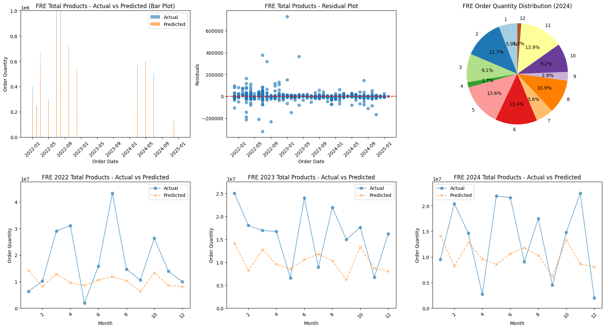
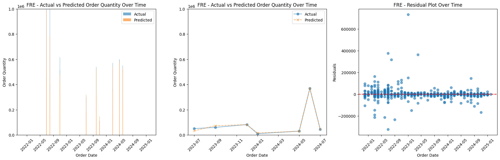
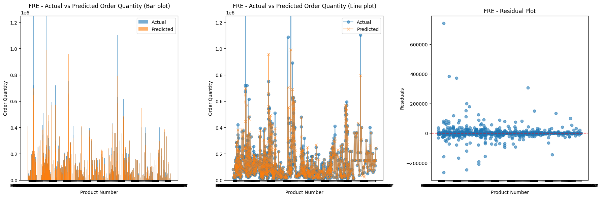
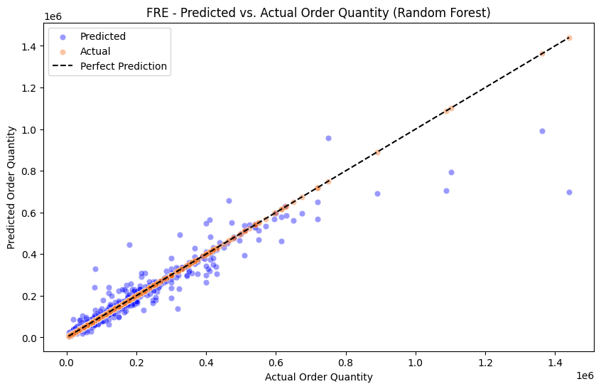

# Demand/Stock Forecasting

## Short update:

Finished looking for best models for the dataset. Random Forest came to be the best performing.

Currently after hyperparm training and adding more independent variables i have raised my R2 - 90% and MAE are around 15k.

Orders are labels for mainly retailers and supermarkets to make their products more enticing.

- Orders can be 300k+.
- Orders can be very versitile and not have any trends to suggest a increase/decrease in order quantity.

### Current dashboard (Mock up)

This dash is a mock up and will hopefully be transfered into Power BI. This application is being used because its one of the main BI tools used comercially.

#### Overall look of model predictions (Predictions look low due to the random influxes of certain orders)

#### Showing all Product Order Quantities

The line chart demonstates how there are some orders which are really high than usual which is making the yearly customer quantity charts go off-balance.

#### Each Order Quantity - Specifics

Shows how the model acts with all orders. The model captures most of the orders but unexpected increases/decreases can be seen better here.

#### 2022 - 2025 Variance in Actual vs Predicted values

## Independant Features

ProductNumber - Code assigned to each label type.

order_month – The month in which the order was placed.

prev_month_sales – Sales from the previous month.

prev_week_sales – Sales recorded in the previous week.

moving_avg_3m – Three-month moving average of sales.

moving_avg_12m – Twelve-month moving average of sales.

moving_avg_18m – Eighteen-month moving average of sales.

var_12m – Sales variance over the past twelve months.

var_18m – Sales variance over the past eighteen months.

log_var_12m – Log-transformed variance of sales over twelve months. (Deals with outliers better)

log_var_18m – Log-transformed variance of sales over eighteen months. (Deals with outliers better)

yoy_growth – Year-over-year percentage growth in sales.

prev_2_month_sales – Sales from two months ago.

prev_3_month_sales – Sales from three months ago.

moving_avg_6m – Six-month moving average of sales.

var_3m – Sales variance over the past three months.

log_var_3m – Log-transformed variance of sales over three months.

sales_2023 – Total sales recorded in 2023.

sales_2024 – Total sales recorded in 2024.
